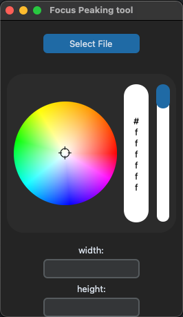

# Пользовательская документация

## Установка и запуск

### 1. Установка через пакетный менеджер pip:

#### 
-Клонируйте репозиторий

    https://github.com/c1kvoy/CG1

#### 
-Создайте виртуальное окружение 

    python venv -m nameofenv
#### 
-Установите зависимости из файла requirements.txt

    pip install -r requirements.txt
#### 
-Запустите скрипт Python:

    python main.py

### 2. Установка через poetry:
#### 
-Клонируйте репозиторий

    https://github.com/c1kvoy/CG1

#### 
-Установите зависимости

    poetry install

#### 
-Активируйте оболочку poetry

    poetry shell
#### 
-Запустите скрипт Python:

    python main.py

## Использование программы

#### 1) Выберете цвет обводки контура
#### 2) Введите в поля _width_ и _height_ желаемое разрешение выходного видеофайла(опционально)
#### 3) Нажмите кнопку _Select file_, чтобы выбрать файл, в котором вы желаете выделить контуры резкости, после выберете имя выходного видеофайла и место куда вы хотите его сохранить
#### 4) После выполнения обводки, либо при ошибке вы увидите всплывающее окно

